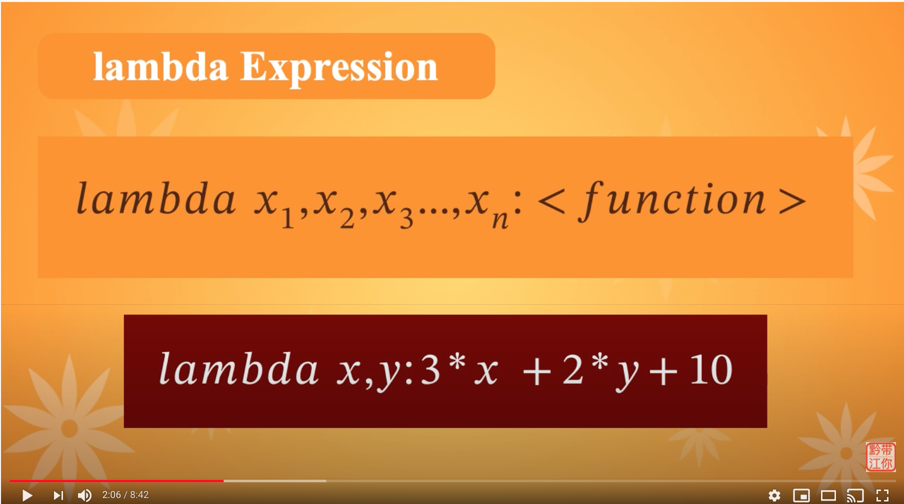
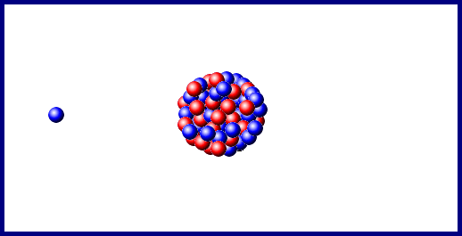
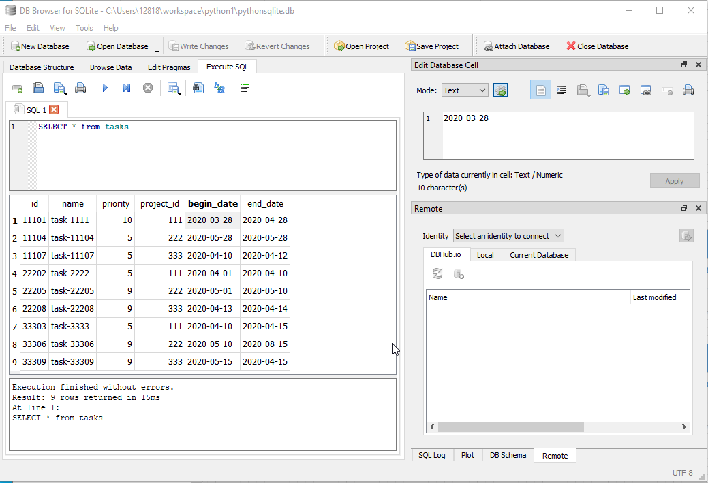

# 华夏中文学校 Python level-II
**Learn From Mistakes**
* My own mistakes
    - avoid mistakes made before

    

    - make mistake and learn

    
    
    - myassert/indexOutOfBound.py 
* Other's mistake

    

* Pay attention to error message, especially last line
```
ModuleNotFoundError: No module named 'matplotlib'
```

```
Traceback (most recent call last):
  File "c:\Users\12818\workspace\python-II\cardGame\card5.py", line 82, in <module>
    club2 = Card(Faces.TWO, Suits.CLUBS)
TypeError: Can't instantiate abstract class Card with abstract method getValue
```
## Python 编写应用软件的几大要素
1. logging ([Java Logging](#Logging))
2. Unit test ([Unit Test](#Unit-Test))
3. Document ([Python Document](#Python-Document))
4. Database Access ([Sqlite](#Sqlite))
5. Source Version Control ([Git](#Git))

## Table of Contents
1. [Git](#Git)
1. [assert](#assert)
1. [Command Line Arguments](#Command-Line-Arguments)
1. [Python Document](#Python-Document)
1. [Understand Dunder Functions](#Understand-Dunder-Functions)
1. [Sqlite](#Sqlite)
1. [OOP programming](#OOP-programming)
1. [Type Sensitive](#Type-Sensitive)
1. [Try Except](#Try-Except)
1. [Unit Test](#Unit-Test)
1. [enum](#enum)
1. [Blackjack Card Game](#Blackjack-Card-Game)
1. [Functional Programming](#Functional-Programming)
1. [Logging](#Logging)
1. [Lambda Expression](#Lambda-Expression)
1. [Rx Observer](#Rx-Observer)
1. [either](#either)
1. [monad](#monad)
1. [Design Pattern](#Design-Pattern)
1. [References](#References)
---
[Table of Contents](#Table-of-Contents)


## Git
Source code version control
* check git availability
* get source code from GitHub
* frequently used git command
```
git --version
git config user.name "jwang1122"
git config user.email "jwang1122@gmail.com"
git status
git add .
git commit -m "some message"
git push
git pull
git clone https://github.com/jwang1122/python2.git
git log --oneline
git branch
git branch <new brance name>
git checkout <branch name>


```
---
[Table of Contents](#Table-of-Contents)

## assert


    - [Practice]: write program using keywords we have learned.
./myassert
* assert0.py
* assert1.py
* assert2.py
* async1.py
* async2.py
* async3.py
* async4.py
* async5.py
* async6.py
* async7.py
* yield1.py
* yield2.py
* yield3.py
---
[Table of Contents](#Table-of-Contents)

## Command Line Arguments
### What is __init__.py used for?
>The primary use of __init__.py is to initialize Python packages. The easiest way to demonstrate this is to take a look at the structure of a standard Python module.

>__init__.py can be an empty file but it is often used to perform setup needed for the package(import things, load things into path, etc).

./arguments
* arguments1.py; return list of commandline arguments
* arguments2.py; get one commandline argument
* parse.py; parse commandline arguments
    - get commandline arguments
    - define commandline arguments in __init__.py
---
[Table of Contents](#Table-of-Contents)


## Python Document
* use python help
* create my own document
./aDoc
* doc1.py; use """
* circle1.py; use __doc__
* simpleMath.py; document functions
* help()
    _ dir()
    - dir(__spec__)  
    - dir(__builtins__)
* Write Markdown 
    - display link (website, Table of Content, other md file)
    - Greenshot (Greenshot-INSTALLER-1.2.10.6-RELEASE.exe)
    - display image
    - command line (command block)
    - Python source code block
    - bullet point
---
[Table of Contents](#Table-of-Contents)


## enum
* enum1.py; Color extends from Enum, value, type...
* enum2.py; key and value unique
* enum3.py; duplicated key
* enum4.py; use name for key, ordered list
* enum5.py; use @unique decorator
* enum6.py; use auto() function for value if you don't care the value
* enum7.py; override _generate_next_value_() function use name as enum value
* enum8.py; compare enum by "is" or "is not"
* enum9.py; define function in enum
* enum10.py; callable Enum()
* enum11.py; use enum name or value as list index
* enum12.py; IntFlag enum can be used for bitwise operations
* enum13.py; add more value to enum
* enum14.py; generate value by using auto(), Object(), str. Practice use name as value
* enum15.py; generate squence number as enum value __new__()
* enum16.py; same as above, __init__()
* enum17.py; implements __gt__, __lt__,__ge__, __le__ function for enum comparison
---
[Table of Contents](#Table-of-Contents)

## OOP Programming


./pythonClass
* MyClass.py; class with variable and function
* addNewMethod.py; add method to existing class
* student1.py; Simple class with __init__, __repr__, and increaseGrade()
    - [Practice]: look around, find anything catch your eye, create a class of it
* inheritence.py; empty subclass
* person1.py; class Person:
* student2.py; class Student(Person) using person1.py
* person2.py; class Employee(Person)
* student3.py; load csv file, build student objects
    - [Practice]: create a super class and sub class
* intervace
    - interface1.py; implementation class with no abstract function defined
    - interface2.py; Compare student by interface Comparable
    - super class (person.py)
    - sub class (employee, manager)
* abstract class
    - abstractClass1.py; @abc.abstractmethod
    - abstractClass2.py; no implementation area() function
    - abstractClass3.py; @Shape.register useless
    - abstractClass4.py; check type, polymorphism

* polymorphism.py (person1.py, student2.py, teacher.py)
* encapsulation.py (private variable: __ssn) project ssn to be accessed directly

    You need getter/setter to access them.

---
[Table of Contents](#Table-of-Contents)

## Type Sensitive
./typing
```
pip install mypy
```
* circle.py
* circleTest.py
* typing1.py
* typing2.py
* typing3.py
* typing4.py
* typing5.py

[Typing Read Me](TypingReadMe.md)

---
[Table of Contents](#Table-of-Contents)

## Functional Programming
./function
* variableArgs.py; variable arguments
* func.py; pass function to function, return function from function
* func0.py; another sample for passing and return function
* func1.py; calculate area by passing function to function
* func2.py; inner function: define function in function
* func3.py; return function from function conditionally
* func4.py; use parameter generate different math function
    - [Practice]: define average function (assert1.py)
    - [Practice]: pass function, return function

* func5.py; use one function to do sample math
* funcAttribute.py; getattr()
* funcEither.py; Left/Right with logging
* area1.py; if-else calculate areas
* area2.py(areaTable.py)
* classDecorator.py; 
* decoratorFunctionWithArguments
* decoratorWithArguments.py
* defineFunction.py;
* entry_exit1.py; @entry_exit
* entry_exit2.py; @entry_exit __init__() __call__()
./timerDecorator
* my_timer.py
* my_timer1.py
* my_timer2.py;
* my_timer3.py;
* timerDecorator.py;
* switch.py; use Month as dict
* switcher.py; store function in dict
---
[Table of Contents](#Table-of-Contents)

## Logging
./loggin

* logging1.py
    - [Practice]: add logging in simple math add, sub, mul, div
    - [Practice]: write logging to card game

```py
>>> import logging
>>> help(logging)
```
---
[Table of Contents](#Table-of-Contents)


## Try Except
    

* circle1.py
* raise Error
```py
    if type(r) not in [int, float]:
        raise TypeError(f"The radius must be a real number, r={r}")
```
```py
def addOver5(x, y):
    if x<5 or y<5:
        raise Exception('both x and y should > 5')
    return x + y
```
* circle2.py
* catch Error
```py
try:
    area = circle_area(4)
    print("12:",area)
    area = circle_area(4.3)
    print("14:",area)
except Exception as error:
    print("12:",error)
```
* circle3.py
    - python > dir(__builtins__) > TypeError > ValueError
* circleTest1.py
* circleTest2.py
* finally.py;
* math1.py
* try-expectTest1.py; every function add try-expect
* try-expectTest2.py; one function 
* assert error
./myassert
* assert0.py
* assert1.py
* assert2.py
* indexOutOfRange.py

---
```py
def div(x,y):
    """
    if the condition is not meet, program stop running
    """
    assert y!=0, "divisor cannot be 0."
    return x/y
try:
    z = div(10,0)
except AssertionError as ae:
    print("Error: ", ae)
```
    - assert1.py; assert empty list
    - assert2.py; circle_area assert
* raise Exception
    - circle.py
```py
from math import pi

def circle_area(r):
    return pi * (r**2)
```
test code with -2, 3+4j, "hello"
raise Exception
    - circle1.py
```py
    if type(r) not in [int, float]:
        raise TypeError("The radius must be a real number.")
    if r < 0:
        raise ValueError("The radius cannot be negative.") 
```
do different test, show program terminated in the middle
    - try-except/circleTest.py

---
[Table of Contents](#Table-of-Contents)


## Unit Test
* Configure VS Code Unit Test
    Right-Click > Command Pallete.. > Phthon: Configure Tests > unittest > Root director > test_*.py
* test_Math.py
    - [Practice]: crete unit test for simple math add, sub, mul, div (tuple + int, tuple + tuple, list + list)
* test_card.py
* test_circleArea.py
* test_dealer.py
* test_deck.py
* test_math1.py
* test_player.py
* test_card5.py
---
[Table of Contents](#Table-of-Contents)


## Lambda Expression

    - >>> dir(__builtins__) > map, filter, reduce (no loop)
    - >>> help(map) > map(function, iterable, ...)
    - >>> help(filter)

./lambda/...
* func.py; pass function to function
* lambda.py; 
* lambda1.py;
* map0.py; two variables lambda function


    - map(function, iterable, ...)

* map1.py; convert city temperatures
* map2.py; define the lambda function outside
* map3.py; two variables lambda action on two list
* map4.py; convert list of temperatures
* map5.py; more variables for lambda function
* map6.py; create Card set by using lambda function
* filter0.py; reduce the size of list by certain condition
* filter1.py; reduce the list of temperatures by condition
* filter2.py; find prime by filter function
* reduce.py; use reduce to do sum
* reduce1.py; use reduce to find min and max
* kleisliCompose.py; Compose two functions
* sort0.py; sort by string or object attribute
* sort1.py; sorted vs. sort
* sort2.py; sort temperature
* sort3.py; sort tuple
* sumByTuple.py; 
* zip1.py; zip two list
* zip2.py; sum zipped list
* zip3.py; 
* ./lambda/shoppingMonad1.py (use list bind functions)
* ./lambda/writePythonMonad.py (use monad bind functions)
---
[Table of Contents](#Table-of-Contents)


## either
* either1.py; isEven() function return Either Right or Left
* either2.py; isEven() check input data type
* either3.py; bind multiple functions
* airlineseat.py; 
---
[Table of Contents](#Table-of-Contents)

## monad
* circle1.py; calculate circle area without type checking. __doc__()
* circle2.py; raise exception when input data has wrong type. application terminated in middle
* circle2test.py; surround with try-except to avoid termination
* circle3.py; return Either Right or Left for circle area calculation. better for web service.
### Concepts
* Functor: Wrapper Class type with implementation of fmap() function. Functor-Map 
* Applicative: Wrapper Class type with implementation of fmap(), amap() functions. Applicative-Map 
* Monad: Wrapper Class type with implementation of fmap(), amap() and bind() functions. 

* functor.py; add3 * Just(2)
* applicative.py; add * Just(3) & Just(2)
* monad.py; Just(2) >> add3 >> mul4


* monad1.py; understand Functor
* monad2.py; understand Applicative
* monad3.py; applicative regular call
* monad4.py; function compose
* monad5.py; more compose on list.
* option1.py; understand implementation of Option by using mymonad.py
* option2.py; Rx: Reactive x to write function chain.
* monad6.py; Nothing > wrapper None with Maybe
* monad7.py; _List.map(), _List.then()
* monad8.py; normal function don't know how to handle wrappered variables.
* monad9.py; bind list function
* monad10.py; bind list function
* monad11.py; Use Maybe solve the None issue
* shoppingMonad1.py; monad function chain
* shoppingMonad2.py; combination of RX Observer and Monad
* shoppingMonad3.py; monad with map
* math1.py; monad function chain
* math2.py; compination of Observer and Monad
---
[Table of Contents](#Table-of-Contents)

## Rx Observer
* observer0.py; typical observer function chain
* observer1.py; simple way to create observer iterable
* observer2.py; operators function chain with pipe (map > filter)
* observer3.py; simplify observer2.py
* observer4.py; chain everything together
* observer5.py; internal function
* observer8.py; complete observer function chain
```
on_next is called each time an item is received.
on_completed is called when the observable completes on success.
on_error is called when the Observable completes on error.
```
* observer9.py; disposible
* observer10.py; error handlling

    
* observer11.py; multiple thread asynchronized processing
* observer12.py;
* observer13.py;
* observer14.py;
* observer15.py;

```
python ./observer/observer12.py
```
after server start up
```
telnet localhost 8888
foo
```
* observer13.py;
---
[Table of Contents](#Table-of-Contents)

## Blackjack Card Game
[How to Play Blackjack](https://www.blackjackapprenticeship.com/how-to-play-blackjack/#playerdecideshowtoplayhand)


./Blackjack
* turtle7.py; draw card on frame
* card1.py; use string and int for face, causes issue that bad card can be generated
* card1Test.py;
* card2.py; use enum for both face and suit
* card2Test.py; leave it not passed
* Test Driven Development
    - test_Card2Test.py (==, <, >,)


* blackJackCard.py

* deck.py
* player.py
* dealer.py
    [Practice]: test_dealer() -> test_hit()

* test_card5.py; unit test to test card5.py

    - card.py > class Card (__init__(), __repr__())
    - class Card:
    - class BlackJackCard:
    - unittest test_card.py
    - check error on Grace machine
    - card.py > playGame()
    - Optimize the code > class Game:
    - Game.check4win()
    - [Homework]: write unit test for check4Win() and dealCards()
    - homework > modify code support multi player
    - [Practice]: add bit to players
    - Dealer > deal(), showHand()
    - DealerTest.py
    - def playGame():
    - class Dealer(Player): __init__(), shuffle(), hit(), showHand()
    - unittest test_dealer.py
    - class Deck: > __init__(), nextCard(), shuffle()
    - unittest test_deck.py
    - class Player: > __init__(), __repr__(), addCardToHand(), cleanHand(), getHandValue(), getHandSize(), hit()
    - unittest test_player.py

* Keep in mind, always test your code with small unit.
    - CardTestOne.py
    - DealerTest.py
    - DectTest.py
    - PlayerTest.py
    - PlayerTestOne.py

* BlackJack Card Game document
    [Black Jack](https://next.tech/projects/94217701d98d/share)
* card.py
    - class Card:
    - class BlackJackCard(Card):
* ./cardGame/blackjack.py; > sample code online.
* ./cardGame/blackjack2.py; > another implementation
* ./cardGame/card0.py; single player agains dealer
    - class Card(ABC):
    - class BlackJackCard(Card):
    - class Deck:
    - class Player:
    - class Dealer(Player):
    - def playGame():
* ./cardGame/card1.py; Multi-Players vs Dealer Black Jack Card Game

* ./cardGame/card2.py; Multi-players vs Dealer Black Jack Card Game
without if-else
* ./cardGame/card3.py; with decision table
* ./cardGame/card4.py; with decision table to get rid of if-else
* tableBuilder.py; build cardDecision.py to determin who is winner
* test the result
    - class Game
    - get rid of if-else
    - decision table

---
[Table of Contents](#Table-of-Contents)

## Design Pattern
* command.py
* command5.py
* decorator.py
* decorator0.py
* decorator1.py
* decorator2.py
* decorator3.py
* decorator4.py
* iterator.py
* observer.py
* strategy.py
* strategy2.py
---
[Table of Contents](#Table-of-Contents)

## Understand Dunder Functions
* dunder1.py; \_\_len__, \_\_gt__, \_\_eq__, \_\_contains__, \_\_add__
* dunder2.py; implement \_\_call__(), make class callable
* classDecorator.py; 
* limitUser.py; (using user.py) \_\_name__()
* range1.py; \_\_next__, \_\_iter__ 

    [**homework**](write your own xrange which return real number)
* sort1.py; \_\_lt__(), \_\_eq__()
* sort2.py; \_\_lt__() only
* user.py; \_\_name__
* person1.py; \_\_subclasshook__
---
[Table of Contents](#Table-of-Contents)


## Sqlite
* sqlite0.py > create connection
* sqlite1.py
* sqlite2.py
* install DB browser for SQLite

Google Search: DB Browser for Sqlite

[SQLite GUI Download Website](https://sqlitebrowser.org/dl/)

[SQLite Browser for MacOS](https://sqlitebrowser.org/blog/macos-installer-rebuilt-for-3-11-1/)

File: DB.Browser.for.SQLite-3.12.1-win64-v2.msi


* sqlite4.py
* sqlite5.py
* sqlite6.py


* sqlite7.py > build relational data
* sqlite8.py > show relation between project and task
* review bookdb.py
* sqlite9.py > create books table
* sqlite10.py > insert data into books table
* sqlitebookdb.py > build CRUD
* app5.py > use sqlitebookdb.py to provide service
    use Postman to check the service.
* CRUD huaxia book
```
cd workspace
git clone https://github.com/eagleboatblue/reactjs.git
cd reactjs
cd book-app
npm install
cd ../server
python -m venv env
.\env\Scripts\activate.bat
mongod
python app.py
cd ../book-app
npm start
```
---
[Table of Contents](#Table-of-Contents)

## References
1. [RxPY Document](https://rxpy.readthedocs.io/en/latest/index.html)
1. [Python Interface](https://realpython.com/python-interface/)
1. [__init__.py python package](https://docs.python.org/3/tutorial/modules.html)
1. [Primer on python function](https://realpython.com/primer-on-python-decorators)
1. [Observer Sample](https://www.tutorialspoint.com/rxpy/)
1. [Hi-Low Card Game](https://stevepython.wordpress.com/2018/11/09/python-gui-card-game/)
1. [Reactive X](https://blog.oakbits.com/introduction-to-rxpy.html)
1. [Sqlite Tutorial](https://docs.python.org/3/library/sqlite3.html)
1. [Python typing](https://www.journaldev.com/34519/python-typing-module)
1. [__init__](https://mikegrouchy.com/blog/be-pythonic-__init__py)
1. [async task](https://docs.python.org/3/library/asyncio-task.html)
1. [Machine Learning](https://scikit-learn.org)
1. 
---
[Table of Contents](#Table-of-Contents)

* machine learning
    - sklearn
---
老生
总校
* Daniel Duan（段以理）
* Yichen Wang（王依晨-女）
* Grace Yang （女）
* Mathew Kan （耿大正）
* Jiajun Tang （唐家骏）
糖城
* Eric Wang （王知行）
* Austin Song（宋宇恒）