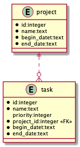
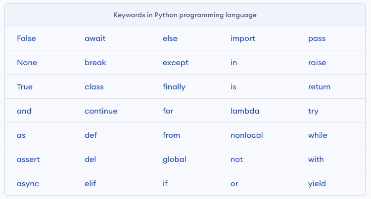

# 华夏中文学校 Python level2

## enum
* enum1.py; Color extends from Enum, value, type...
* enum2.py; key and value unique
* enum3.py; duplicated key
* enum4.py; use name for key, ordered list
* enum5.py; use @unique decorator
* enum6.py; use auto() function for value if you don't care the value
* enum7.py; override _generate_next_value_() function use name as enum value
* enum8.py; compare enum by "is" or "is not"
* enum9.py; define function in enum
* enum10.py; callable Enum()
* enum11.py; use enum name or value as list index
* enum12.py; IntFlag enum can be used for bitwise operations
* enum13.py; add more value to enum
* enum14.py; generate value by using auto(), Object(), str. Practice use name as value
* enum15.py; generate squence number as enum value __new__()
* enum16.py; same as above, __init__()
* enum17.py; implements __gt__, __lt__,__ge__, __le__ function for enum comparison

## either
* either1.py; isEven() function return Either Right or Left
* either2.py; isEven() check input data type
* either3.py; bind multiple functions
* airlineseat.py; 

## monad
* circle1.py; calculate circle area without type checking. __doc__()
* circle2.py; raise exception when input data has wrong type. application terminated in middle
* circle2test.py; surround with try-except to avoid termination
* circle3.py; return Either Right or Left for circle area calculation. better for web service.
### Concepts
* Functor: Wrapper Class type with implementation of fmap() function. Functor-Map 
* Applicative: Wrapper Class type with implementation of fmap(), amap() functions. Applicative-Map 
* Monad: Wrapper Class type with implementation of fmap(), amap() and bind() functions. 

* functor.py; add3 * Just(2)
* applicative.py; add * Just(3) & Just(2)
* monad.py; Just(2) >> add3 >> mul4


* monad1.py; understand Functor
* monad2.py; understand Applicative
* monad3.py; applicative regular call
* monad4.py; function compose
* monad5.py; more compose on list.
* option1.py; understand implementation of Option by using mymonad.py
* option2.py; Rx: Reactive x to write function chain.
* monad6.py; Nothing > wrapper None with Maybe
* monad7.py; _List.map(), _List.then()
* monad8.py; normal function don't know how to handle wrappered variables.
* monad9.py; bind list function
* monad10.py; bind list function
* monad11.py; Use Maybe solve the None issue


## References
[Python Interface](https://realpython.com/python-interface/)
[__init__.py python package](https://docs.python.org/3/tutorial/modules.html)
[Primer on python function](https://realpython.com/primer-on-python-decorators)


## 2020-07-30 
* sqlite database (continue)

    - sqlite5.py
    - sqlite6.py
    - sqlite7.py > build relational data
    - sqlite8.py > show relation between project and task

* Review
    - Handle Exception try-except 
    [Practice]: indexOutBound.py
```py
def addOver5(x, y):
    if x<5 or y<5:
        raise Exception('both x and y should > 5')
    return x + y
```
    - assert
    
    [Practice]: indexOutBound.py
    - Write unit test
    [Practice]: test_dealer() -> test_hit()
    - logging
    [Practice]: write logging to card game
    - card.py
    
    [Practice]: create a super class and sub class
    - Functional programing
    [Practice]: pass function, return function
    - lambda expression
    - map, filter, sort, zip
    - either, function binding
    - sqlite

[website](https://scikit-learn.org)
* machine learning
    - sklearn

* Reactive X > RePY mo
    - observer0.py
    - observer1.py
    - observer2.py
    - observer3.py
    - observer4.py
    - observer5.py
## 2020-07-29 
* Functional Programing (Continue)
    - shoppingMonad.py (use list bind functions)
    - writePythonMonad.py (use monad bind functions)

* sqlite database
[Tutorial](https://docs.python.org/3/library/sqlite3.html)
    - sqlite0.py > create connection
    - sqlite1.py
    - sqlite2.py

    - sqlite4.py
    - sqlite5.py
    - sqlite6.py
    - sqlite7.py > build relational data
    - sqlite8.py > show relation between project and task

* design pattern
    - observer
    - command
    - strategy

 
## Functional Programing (Continue)
* area.py
* area1.py
* area2.py(areaTable.py)
* monad
    - either
    either0.py~~

    
        
        * either1.py
        * either2.py
    - monad.py (understand Just() box)
--
## 2020-07-27 
* command line arguments
    - get commandline arguments
    - define commandline arguments in __init__.py
    - map0.py, map1.py, map2.py, map3.py
    - filter0.py, filter1.py
    - reduce.py (functools.reduce())
    - sort1.py (sorted())
    - sort2.py (list.sort())
    - zip1.py
    - either
        * either0.py
        * either1.py
        * either2.py
    - monad.py (understand Just() box)
    - writePythonMonad.py
---
## 2020-07-23
* lambda expression
    - defineFunction.py
    - func.py
    - lambda.py (anonymous function)
    
    - >>> dir(__builtins__) > map, filter, reduce (no loop)
    - >>> help(map) > map(function, iterable, ...)
    - >>> help(filter)
    - 
    - map(function, iterable, ...)
---
## 2020-07-22
* switch
    - variableArgs.py
* pass function to a function as argument
    - func1.py
* return a function from a function
    - func2.py
* timer decorator
    - uderstand pass/return function function/func1.py
    - my_timer1.py understand wrapper function
    - my_timer2.py

* Functional Programming
---
## 2020-07-21
* switch
    - switch.py
    - function as dict value (switcher.py)
* Card Game Continue
    - card3.py

---
## 2020-07-20
* Card game continue
    - class Game
    - get rid of if-else
    - decision table

---
## 2020-07-16
* Black Jack Card (Continue)
    - check error on Grace machine
    - card.py > playGame()
    - Optimize the code > class Game:
    - Game.check4win()
    - [Homework]: write unit test for check4Win() and dealCards()
    - homework > modify code support multi player
    - [Practice]: add bit to players

* assert

    - [Practice]: write program using keywords we have learned.
    - assert0.py
    - assert1.py
    - assert2.py

* passing function instead of variable 
    - [Practice]: define average function (assert1.py)
    - func0.py
    - func.py
    - func1.py

* return function instead of variable
    - func2.py
---
## 2020-07-15
* Black Jack Card Game(continue)
    - Dealer > deal(), showHand()
    - DealerTest.py
    - def playGame():
---
## 2020-07-14
    - class Dealer(Player): __init__(), shuffle(), hit(), showHand()
    - unittest test_dealer.py

---
## 2020-07-13

    - class Deck: > __init__(), nextCard(), shuffle()
    - unittest test_deck.py
    - class Player: > __init__(), __repr__(), addCardToHand(), cleanHand(), getHandValue(), getHandSize(), hit()
    - unittest test_player.py

---
# 2020-07-09

    - card.py > class Card (__init__(), __repr__())
    - class Card:
    - class BlackJackCard:
    - unittest test_card.py

---
# 2020-07-08
* Unit test
    - [Practice]: crete unit test for simple math add, sub, mul, div (tuple + int, tuple + tuple, list + list)

* Logging
    - logging1.py
    - [Practice]: add logging in simple math add, sub, mul, div

* OOP programing concept
    - 

    - 
    - [Practice]: student.py
    - load csv, build student objects
    - [Practice]: look around, find anything catch your eye, create a class of it

* Inheritence
    - super class (person.py)
    - sub class (employee, manager)
    
## 2020-07-07

* try-except function
    - python > dir(__builtins__) > TypeError > ValueError
    - try-exceptTest2.py
    - [Practice]: implement math function add, sub, mul, div

* Unit test
    - Command Pallete > Python: Configure Tests > unittest > . Root directory > test_*.py
    - Command Pallete > Python: Discover Tests 
    - test_circleArea.py
    - [Practice]: crete unit test for simple math add, sub, mul, div (tuple + int, tuple + tuple, list + list)

* Logging
    - logging1.py
    - [Practice]: add logging in simple math add, sub, mul, div

```py
>>> import logging
>>> help(logging)
```

## 2020-07-06
* CRUD huaxia book
```
cd workspace
git clone https://github.com/eagleboatblue/reactjs.git
cd reactjs
cd book-app
npm install
cd ../server
python -m venv env
.\env\Scripts\activate.bat
mongod
python app.py
cd ../book-app
npm start
```

* raise Exception
    - circle.py
```py
from math import pi

def circle_area(r):
    return pi * (r**2)
```
test code with -2, 3+4j, "hello"
raise Exception
    - circle1.py
```py
    if type(r) not in [int, float]:
        raise TypeError("The radius must be a real number.")
    if r < 0:
        raise ValueError("The radius cannot be negative.") 
```
do different test, show program terminated in the middle
    - try-except/circleTest.py

* try-except Block
    - try-exceptTest.py
    - circleTest2.py
    - try-catchTest.py (add try-except block, make code non-stop)
    - try-catchTest1.py (optimize code)
 

[Hi-Low Card Game](https://stevepython.wordpress.com/2018/11/09/python-gui-card-game/)

老生
总校
* Daniel Duan（段以理）
* Yichen Wang（王依晨-女）
* Grace Yang （女）
* Mathew Kan （耿大正）
* Jiajun Tang （唐家骏）
糖城
* Eric Wang （王知行）
* Austin Song（宋宇恒）