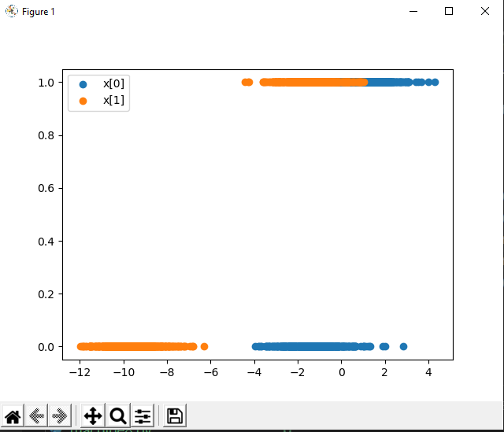

# Machine Learning Processing
Machine learning (ML) is a branch of Artificial Intelligence (AI). The primary purpose of machine learning is to teach a program on how to train itself and learn from mistakes. The goal is for the program to continuously learn and develop the accuracy of its prediction without being regularly trained to do so. Here is a useful link if you’re interested in learning more.

* det data
* training
* validation
* testing
* Data Preprocessing
* Parameter Tuning
* Training a Model
    - Logistic Regression (LR)
    - Linear Discriminant Analysis (LDA)
    - K-Nearest Neighbors (KNN).
    - Classification and Regression Trees (CART).
    - Gaussian Naive Bayes (NB).
    - Support Vector Machines (SVM).
* test model
* Make Predictions

1. [A Gentle Introduction to k-fold Cross-Validation](https://machinelearningmastery.com/k-fold-cross-validation/)
1. [Machine Learning](https://scikit-learn.org)
1. [Machine Learning Step by Step](https://machinelearningmastery.com/machine-learning-in-python-step-by-step/)
1. [How to Index, Slice and Reshape NumPy Arrays for Machine Learning](https://machinelearningmastery.com/index-slice-reshape-numpy-arrays-machine-learning-python/)
1. [Introduction to Random Number Generators for Machine Learning in Python](https://machinelearningmastery.com/introduction-to-random-number-generators-for-machine-learning/)
1. [How to Make Predictions with scikit-learn](https://machinelearningmastery.com/make-predictions-scikit-learn/)
1. [Save and Load Machine Learning Models in Python with scikit-learn](https://machinelearningmastery.com/save-load-machine-learning-models-python-scikit-learn/)
1. [How to Gather Data for Machine Learning](https://bugfender.com/blog/how-to-gather-data-for-machine-learning%EF%BB%BF/)
1. [Real-world data](https://livebook.manning.com/book/real-world-machine-learning/chapter-2/1)
1. [How to Connect Model Input Data With Predictions for Machine Learning](https://machinelearningmastery.com/how-to-connect-model-input-data-with-predictions-for-machine-learning/)