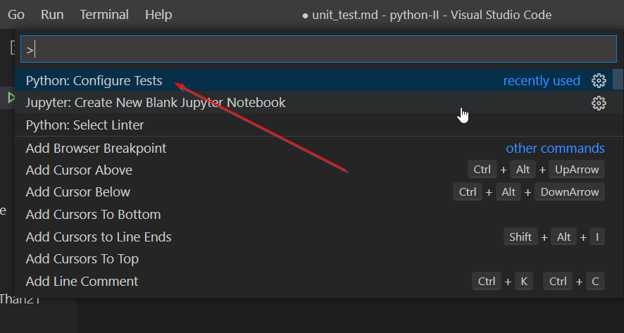
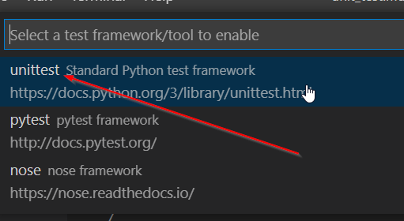
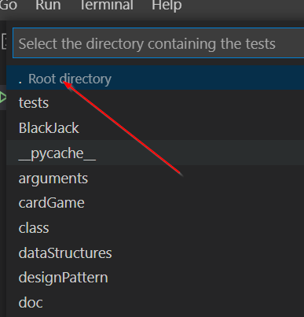
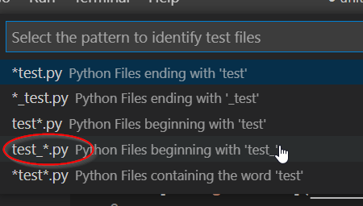
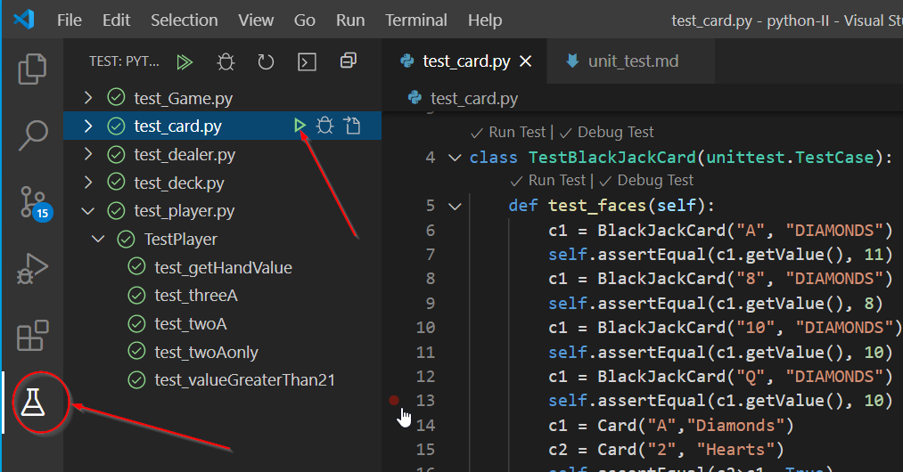

# How to do Unittest in VSCode

1. Right-click > Command Pallete...(Ctrl+Shift+p)
1. Python: Configure test
1. unittest Standard Python test framework
1. .Root Directory
1. test_*.py
1. on left tool bar, click Flask Test icon

